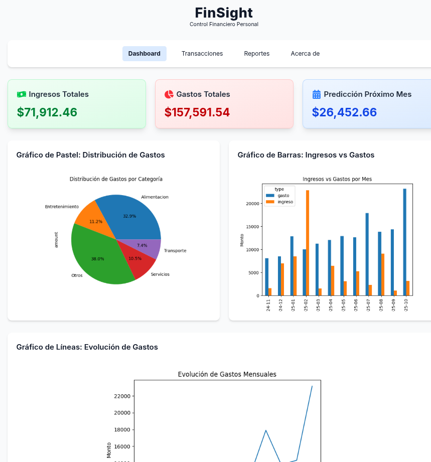
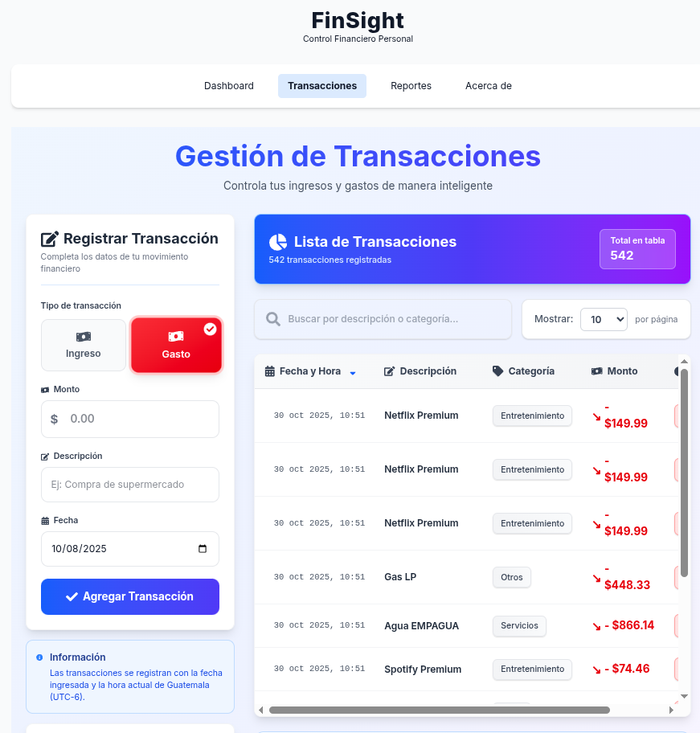
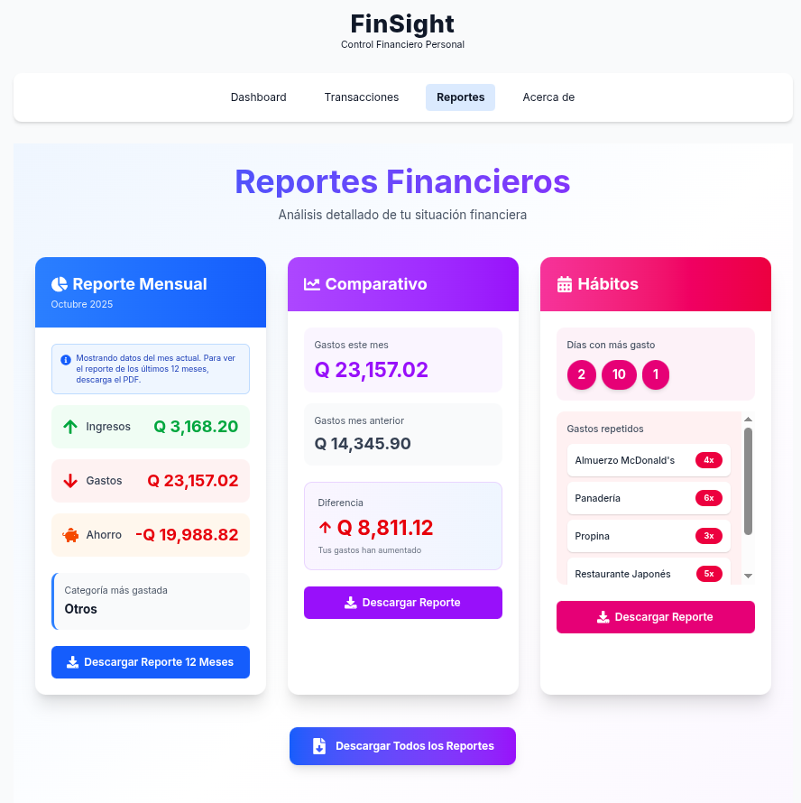

# Asistente Financiero Predictivo Para Emprendedores

Una simple aplicación para gestionar finanzas personales hecha con las opciones para frontend React, Next.js y backend Flask.

## Descripción General

FinSight es una aplicación web completa para la gestión financiera personal que combina seguimiento de transacciones con análisis avanzados y funciones predictivas. El sistema categoriza automáticamente los gastos, genera informes detallados y proporciona información accionable para ayudar a los usuarios a tomar mejores decisiones financieras.

## Características Principales

### Gestión de Transacciones
- Registro de ingresos y gastos con categorización automática
- Interfaz intuitiva para agregar transacciones con tipo, monto, descripción y fecha
- Soporte para múltiples categorías de gastos: Transporte, Alimentación, Entretenimiento, Servicios y Otros
- Historial completo de transacciones con búsqueda y filtrado
- Marcas de tiempo con zona horaria de Guatemala (GMT-6)

### Panel de Control (Dashboard)
El dashboard proporciona una vista general de tu situación financiera:
- Resumen de ingresos totales
- Total de gastos acumulados
- Predicción de gastos para el próximo mes basada en análisis histórico
- Gráfico de pastel con distribución porcentual de gastos por categoría
- Gráfico de barras comparativo de ingresos vs gastos mensuales
- Gráfico de líneas mostrando la evolución temporal de gastos

### Sistema de Alertas Inteligentes
El sistema monitorea automáticamente los últimos 3 meses de datos y genera alertas clasificadas por severidad:

**Alertas Críticas:**
- Déficit mensual cuando los gastos superan los ingresos
- Ahorro negativo en el período analizado

**Alertas de Alta Prioridad:**
- Gastos elevados por categoría comparados con el promedio histórico
- Tendencias crecientes en gastos mensuales consecutivos
- Ausencia de ingresos registrados
- Proyecciones de gasto excesivo para fin de mes

**Alertas de Prioridad Media:**
- Transacciones inusualmente grandes detectadas estadísticamente
- Gastos hormiga acumulados
- Tasa de ahorro baja (menor al 20%)
- Categorías de gasto dominantes (más del 40% del total)
- Posibles transacciones duplicadas

### Reportes Especializados

La aplicación ofrece tres tipos de reportes descargables:

**Reporte Mensual:**
- Datos del mes actual con análisis detallado
- Desglose de ingresos, gastos y ahorro
- Categoría con mayor gasto
- Opción de descargar reporte de los últimos 12 meses

**Reporte Comparativo:**
- Comparación entre el mes actual y el anterior
- Diferencia absoluta y porcentual de gastos
- Análisis de tendencias

**Reporte de Hábitos:**
- Días del mes con mayor gasto
- Gastos repetidos más frecuentes con contador de ocurrencias
- Identificación de patrones de consumo

### Análisis Financiero
- Resúmenes mensuales de ingresos y gastos
- Cálculos de ganancia o pérdida neta
- Promedios mensuales de ingresos y gastos
- Porcentaje de ahorro respecto a ingresos totales
- Comparación de gastos entre períodos
- Identificación de categorías con mayor gasto
- Análisis de días con mayores gastos

### Predicción de Gastos
- Modelo de predicción basado en regresión lineal
- Proyección de gastos para el próximo mes utilizando datos históricos
- Requiere al menos 3 meses de datos para generar predicciones confiables

### Visualizaciones Interactivas
- **Gráfico de Pastel:** Distribución porcentual de gastos por categoría
- **Gráfico de Barras:** Comparación mensual de ingresos vs gastos
- **Gráfico de Líneas:** Evolución temporal de gastos mensuales

## Tecnologías

### Backend
- Flask: Framework web para API REST
- Pandas: Procesamiento y análisis de datos
- Matplotlib: Generación de gráficos
- SciPy: Análisis estadístico y regresión lineal
- NumPy: Operaciones numéricas
- Pytz: Manejo de zonas horarias
- Flask-CORS: Soporte para peticiones cross-origin

### Frontend
- Interfaz web responsiva y moderna
- Diseño intuitivo con visualización clara de datos
- Sistema de navegación por pestañas (Dashboard, Transacciones, Reportes, Acerca de)
- Componentes visuales para alertas con códigos de color por severidad
- Formularios interactivos para registro de transacciones

### Almacenamiento
- CSV: Almacenamiento persistente de transacciones
- Sistema automático de respaldo

## API Endpoints

### Transacciones
- `POST /transaction` - Agregar nueva transacción
- `GET /transactions` - Obtener todas las transacciones

### Análisis y Reportes
- `GET /analysis` - Análisis financiero general
- `GET /alerts` - Obtener alertas inteligentes
- `GET /prediction` - Predicción de gastos futuros
- `GET /reports/monthly` - Reporte del mes actual
- `GET /reports/monthly-12` - Reporte de últimos 12 meses
- `GET /reports/comparative` - Comparación entre meses
- `GET /reports/habits` - Análisis de hábitos de gasto

### Gráficos
- `GET /graphs/bar` - Gráfico de barras
- `GET /graphs/pie` - Gráfico circular
- `GET /graphs/line` - Gráfico de líneas

# 🚨 COSAS QUE CAMBIAR
Hay que adaptarlo a producción, como por ejemplo usar variables de entorno, y yo movería para más eficiencia, las gráficas de imágenes a chart.js. Habría que reformar todo el proyecto.
